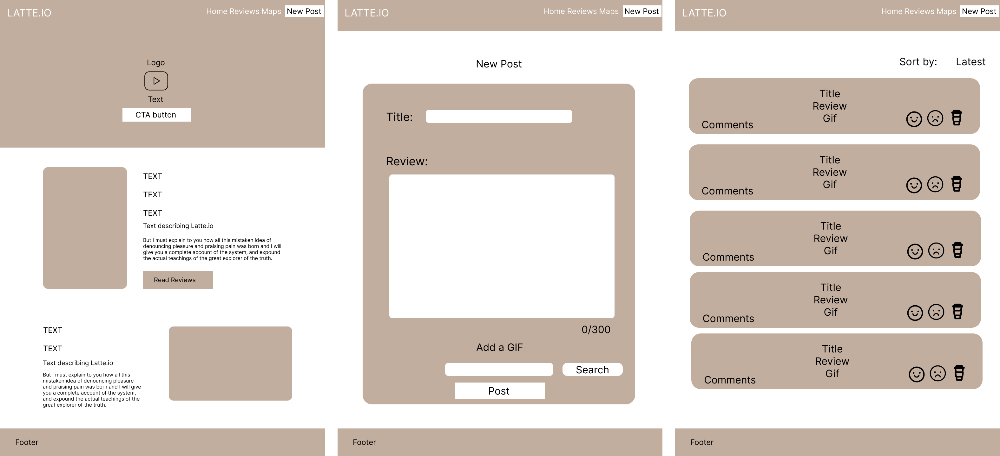

# Project Latte.io
Lap 1 Project: Community Journalling Website

Contributors:
- [Thayaan Srisathialingam] (https://github.com/THAYAANS/)
- [Liberty Sprackling] (https://github.com/LibertySprackling/)
- [Trina Yau] (https://github.com/trinayau/)
- [Andrew Kennedy] (https://github.com/akennedy205/)

## Project Description
Latte.io was borne out of the team's mutual love for coffee and passion for helping small businesses in the UK thrive. Users can use the website to anonymously review coffee shops and check out reviews left by other users to find new coffee shops to visit. 

## Installation and Usage
### Installation
Running the server locally (not using Heroku)
- Clone the repo
- `cd` into the kewlbeans folder in your terminal
- Install dependencies listed below using terminal

### Dependencies:
- Express `npm i express`
- Cors `npm i cors`
- Body Parser `npm i body-parser`

### Usage
- Use the Netlify website which interacts with the server hosted on Heroku 

## Technologies 
### Front End 
- BootStrap v4.6
- GIPHY API

### Back End
- Node.js
- Express
- NPM Libraries: body parser, cors, file system

## Process
### Initialising
On the first day of receiving the project details, we agreed on a team name (Team Latte) and a concept for our project, which was
We designated project roles and discussed everyone's strength and weaknesses. For example, who was more inclined towards front end or back end work, and who wanted to do more project management and deployment tasks.
We pulled together basic information for a project vision board, such as ideal customer, name of site and the purpose of the site. 
Add-ons were also discussed, including stretch goals.
Discussions included:
- Preparing README prototype and presentation
- Favicon selection
- Low-fidelity wireframe for rapid prototyping

### Adding Features
We initially implemented separation of concerns with different Client and Server folders. This was later amended as we needed the server files to be exposed in the root for Heroku deployment. We made different branches for development on GitHub for each of us and got to work on adding the required features of:
- Posting from web page and storing data in a JSON file
- Call on GIPHY API when posting 

### Deploying
- 

## License
MIT License
## 
